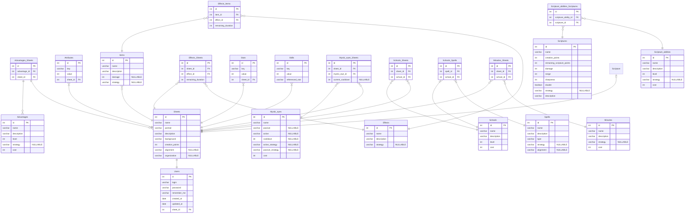

# crud_rpg_php

```mermaid
erDiagram
    Sheets {
        int id PK
        varchar name
        varchar portrait
        varchar description
        varchar background
        int creation_points
        varchar alignment "NULLABLE"
        varchar organization "NULLABLE"
    }

    Users {
        int id PK
        varchar login
        varchar password
        varchar remember_me
        date created_at
        date updated_at
        int sheet_id FK
    }

    Advantages {
        int id PK
        varchar name
        varchar description
        int level
        varchar strategy "NULLABLE"
        int cost
    }

    Advantages_Sheets {
        int id PK
        int advantage_id FK
        int sheet_id FK
    }

    Attributes {
        int id PK
        varchar key
        int value
        int sheet_id FK
    }

    Items {
        int id PK
        varchar name
        varchar description
        int damage "NULLABLE"
        varchar strategy "NULLABLE"
    }

    Effects {
        int id PK
        varchar name
        varchar description
        varchar strategy "NULLABLE"
    }

    Effects_Items {
        int id PK
        int item_id FK
        int effect_id FK
        int remaining_duration
    }

    Effects_Sheets {
        int id PK
        int sheet_id FK
        int effect_id FK
        int remaining_duration
    }

    Stats {
        int id PK
        varchar key
        int value
        int sheet_id FK
    }

    Skills {
        int id PK
        varchar key
        int value
        varchar referenced_stat
    }

    Mystic_eyes {
        int id PK
        varchar name
        varchar passive "NULLABLE"
        varchar active "NULLABLE"
        int cooldown "NULLABLE"
        varchar active_strategy "NULLABLE"
        varchar passive_strategy "NULLABLE"
        int cost
    }

    Mystic_eyes_Sheets {
        int id PK
        int sheet_id FK
        int mystic_eye_id FK
        int current_cooldown "NULLABLE"
    }

    Schools {
        int id PK
        varchar name
        varchar description
        int level
        int cost
    }

    Schools_Sheets {
        int id PK
        int sheet_id FK
        int school_id FK
    }

    Spells {
        int id PK
        varchar name
        varchar description
        varchar type
        varchar strategy "NULLABLE"
        varchar alignment "NULLABLE"
    }

    Schools_Spells {
        int id PK
        int spell_id FK
        int school_id FK
    }

    Miracles {
        int id PK
        varchar name
        varchar description
        varchar strategy "NULLABLE"
        int cost
    }

    Miracles_Sheets {
        int id PK
        int sheet_id FK
        int school_id FK
    }

    Scriptures {
        int id PK
        varchar name
        int creation_points
        int remaining_scripture_points
        int damage
        int range
        int sharpness
        boolean double
        varchar strategy "NULLABLE"
        varchar description
    }

    Scripture_abilities {
        int id PK
        varchar name
        varchar description
        int level
        varchar strategy "NULLABLE"
        int cost
    }

    Scripture_abilities_Scriptures {
        int id PK
        int scripture_ability_id FK
        int scripture_id FK
    }

    Sheets 1--1 Users : ""
    Advantages_Sheets 1--0+ Advantages : ""
    Advantages_Sheets 1--0+ Sheets : ""
    Attributes 1+--1 Sheets : ""
    Items 0+--1 Sheets : ""
    Effects_Items 0+--1 Items : ""
    Effects_Items 0+--1 Effects : ""
    Effects_Sheets 0+--1 Sheets : ""
    Effects_Sheets 0+--1 Effects: ""
    Stats 1+--1 Sheets : ""
    Skills 1+--1 Sheets : ""
    Mystic_eyes_Sheets 0+--1 Mystic_eyes : ""
    Mystic_eyes_Sheets 0+--1 Sheets : ""
    Schools_Sheets 0+--1 Schools : ""
    Schools_Sheets 0+--1 Sheets : ""
    Schools_Spells 1+--1 Schools : ""
    Schools_Spells 1+--1 Spells : ""
    Miracles_Sheets 0+--1 Sheets : ""
    Miracles_Sheets 0+--1 Miracles : ""
    Scripture o|--1 Sheets : ""
    Scripture_abilities_Scriptures 0+--1 Scriptures : ""
    Scripture_abilities_Scriptures 0+--1 Scripture_abilities : ""
```

